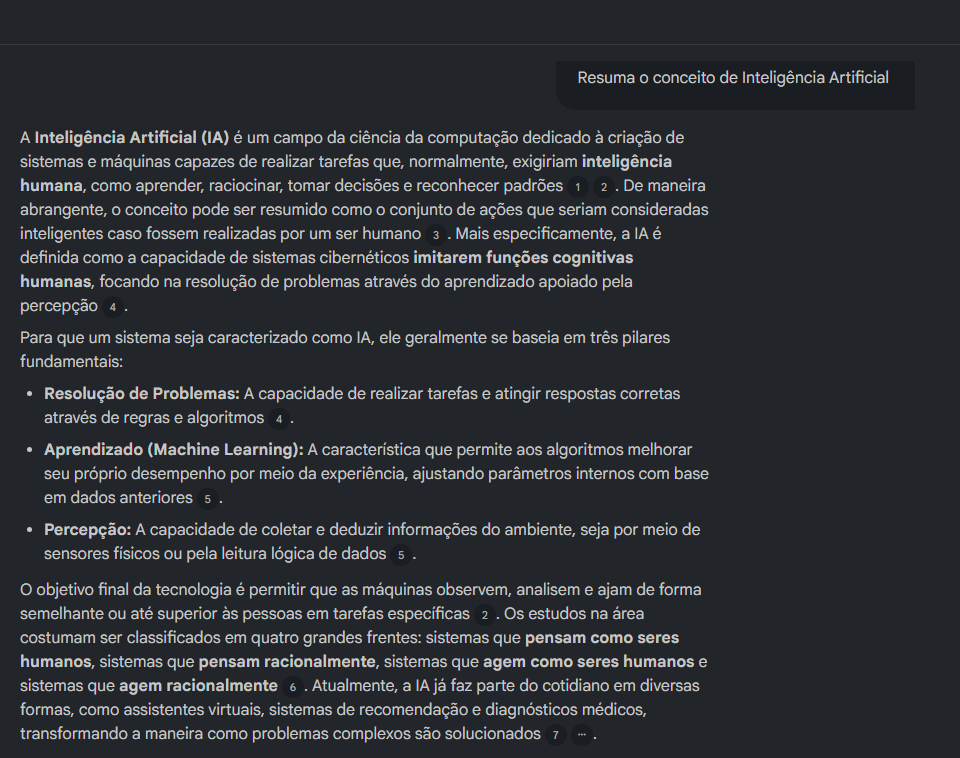
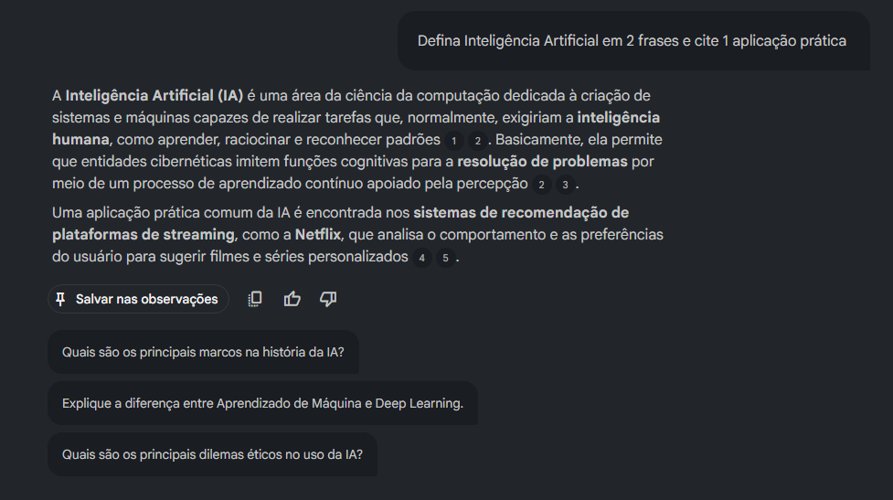

# Caderno Temático com NotebookLM: Introdução à Inteligência Artificial

## Contexto e Objetivos

Neste projeto, utilizei o **NotebookLM** (ferramenta de IA do Google) para criar um caderno temático sobre **Introdução à Inteligência Artificial**.

**Objetivos de estudo:**
- Entender os conceitos fundamentais de Introdução à Inteligência Artificial
- Aprender a aplicar Introdução à Inteligência Artificial na prática
- Desenvolver habilidades de curadoria de conteúdo e engenharia de prompts
- Criar um material reutilizável para revisões futuras

Esse caderno demonstra como a IA pode ser usada como ferramenta ativa de aprendizagem.

## Curadoria de Fontes

Selecionei **4 fontes abertas** de qualidade (todas em texto ou PDF). Elas foram enviadas para o NotebookLM:

1. **A linha do tempo da Inteligência Artificial** - [\[Link\]](https://www.atra.com.br/2024/10/24/a-linha-do-tempo-da-inteligencia-artificial/)

4. **Tipos de inteligência artificial e as funções de cada uma** - [\[Link\]](https://www.braze.com/pt-br/resources/articles/tipos-de-inteligencia-artificial)

2. **Manual de Inteligência Artificial** - [\[Link\]](https://brasil.ia.inesq.org.br/wp-content/uploads/2025/03/Manual-de-Inteligencia-Artificial-Site-Download.pdf) (PDF)

3. **Inteligência Artificial** - [\[Link\]](https://cm-kls-content.s3.amazonaws.com/201802/INTERATIVAS_2_0/INTELIGENCIA_ARTIFICIAL/U1/LIVRO_UNICO.pdf) (PDF)

## Engenharia de Prompts e "Cicatrizes" (Troubleshooting)

Aqui documentei o processo de testes:

**Prompt inicial testado (versão 1):**
> "Resuma o conceito de Inteligência Artificial"

**Problema encontrado:** A resposta foi concisa e clara, então não tive problemas.

**Prompt aprimorado (versão 2):**
> "Resuma o conceito de Inteligência Artificial de forma clara e concisa, depois expanda com tópicos essenciais: principais técnicas, aplicações práticas, benefícios e riscos éticos, marcos históricos e perguntas abertas para aprofundamento; finalize com duas sugestões de termos ou leituras para pesquisa."

**Resultado obtido:** Nenhum, o sistema não conseguiu responder.

**Outra variação testada (versão 3):**
> "Defina Inteligência Artificial em 2 frases e cite 1 aplicação prática."

**Resultado obtido:** Dessa vez ele respondeu, e de forma precisa, exatamente como eu pedi.

**Dificuldades e lições aprendidas:**
- Prompts genéricos geram respostas amplas → solução: sempre especifique formato, público-alvo e pedir citações.
- NotebookLM é fiel apenas às fontes enviadas (não inventa) → importante ter boas fontes.
- Testei 3 variações e experimentei resultados diversos.

## Miniguia de Estudo (Entrega Final)

### Resumos Estruturados
- **Resumo 1:** A Inteligência Artificial (IA) é um campo da ciência da computação dedicado à criação de sistemas e máquinas capazes de realizar tarefas que, normalmente, exigiriam inteligência humana, como aprender, raciocinar, tomar decisões e reconhecer padrões
. De maneira abrangente, o conceito pode ser resumido como o conjunto de ações que seriam consideradas inteligentes caso fossem realizadas por um ser humano
. Mais especificamente, a IA é definida como a capacidade de sistemas cibernéticos imitarem funções cognitivas humanas, focando na resolução de problemas através do aprendizado apoiado pela percepção
.
Para que um sistema seja caracterizado como IA, ele geralmente se baseia em três pilares fundamentais:
Resolução de Problemas: A capacidade de realizar tarefas e atingir respostas corretas através de regras e algoritmos
.
Aprendizado (Machine Learning): A característica que permite aos algoritmos melhorar seu próprio desempenho por meio da experiência, ajustando parâmetros internos com base em dados anteriores
.
Percepção: A capacidade de coletar e deduzir informações do ambiente, seja por meio de sensores físicos ou pela leitura lógica de dados
.
O objetivo final da tecnologia é permitir que as máquinas observem, analisem e ajam de forma semelhante ou até superior às pessoas em tarefas específicas
. Os estudos na área costumam ser classificados em quatro grandes frentes: sistemas que pensam como seres humanos, sistemas que pensam racionalmente, sistemas que agem como seres humanos e sistemas que agem racionalmente
. Atualmente, a IA já faz parte do cotidiano em diversas formas, como assistentes virtuais, sistemas de recomendação e diagnósticos médicos, transformando a maneira como problemas complexos são solucionados

- **Resumo 2:** A Inteligência Artificial (IA) é uma área da ciência da computação dedicada à criação de sistemas e máquinas capazes de realizar tarefas que, normalmente, exigiriam a inteligência humana, como aprender, raciocinar e reconhecer padrões
. Basicamente, ela permite que entidades cibernéticas imitem funções cognitivas para a resolução de problemas por meio de um processo de aprendizado contínuo apoiado pela percepção
.
Uma aplicação prática comum da IA é encontrada nos sistemas de recomendação de plataformas de streaming, como a Netflix, que analisa o comportamento e as preferências do usuário para sugerir filmes e séries personalizados
.

### Glossário de Conceitos
- **Termo 1:** Definição + exemplo
- **Termo 2:** ...
### Glossário de termos sobre Inteligência Artificial

| **Termo** | **Definição breve** |
|---|---|
| **Inteligência Artificial (IA)** | Sistemas que imitam funções cognitivas humanas para resolver problemas. |
| **Resolução de Problemas** | Uso de regras e algoritmos para alcançar respostas corretas. |
| **Aprendizado de Máquina (Machine Learning)** | Algoritmos que melhoram com experiência ajustando parâmetros a partir de dados. |
| **Percepção** | Coleta e interpretação de informações do ambiente por sensores ou dados. |
| **Sistemas que pensam como seres humanos** | Modelos que tentam replicar processos cognitivos humanos. |
| **Sistemas que pensam racionalmente** | Sistemas que usam lógica e raciocínio para tomar decisões ótimas. |
| **Sistemas que agem como seres humanos** | Agentes que imitam comportamento humano observável. |
| **Sistemas que agem racionalmente** | Agentes que escolhem ações para maximizar objetivos definidos. |
| **Sistemas de recomendação** | Aplicações que sugerem conteúdo com base em comportamento e preferências. |
| **Assistente virtual** | Agente conversacional que realiza tarefas e responde a usuários. |
| **Diagnóstico médico assistido por IA** | Uso de modelos para apoiar identificação e prognóstico de doenças. |
| **Riscos éticos** | Questões como viés, privacidade, responsabilidade e impacto social. |

### Prompts Reutilizáveis
Aqui vão prompts que você pode copiar e usar em qualquer NotebookLM futuro:

1. **Prompt para Resumo Estruturado:**
   > "Crie um resumo estruturado sobre [tópico] usando apenas as fontes do caderno. Inclua seções: Introdução, Principais Conceitos, Aplicações Práticas e Conclusão."

2. **Prompt para Glossário:**
   > ...

3. **Prompt para Mapa Mental ou Questões:**
   > ...

*(Vá no NotebookLM, faça as perguntas e cole os melhores resultados aqui.)*

## Conclusão
Esse projeto me ajudou a entender melhor [tema] e a dominar o uso do NotebookLM como ferramenta de estudo ativa.

Link do NotebookLM usado: (opcional, se quiser compartilhar o caderno público)

Feito com ❤️ para o desafio da DIO.